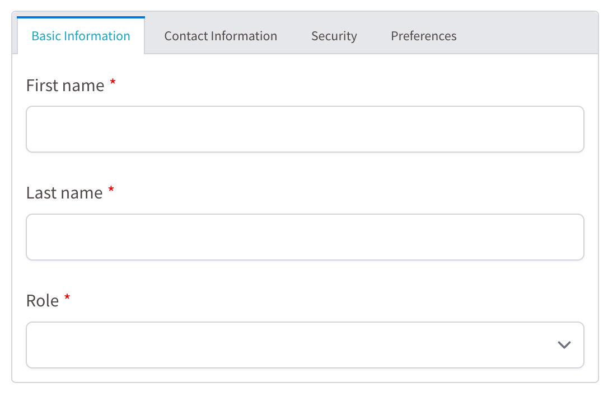

# Schema Formio

<Banner src="https://avatars.githubusercontent.com/u/11790256?s=400&v=4" href="https://www.form.io" :height="180" />

This tutorial shows how to use the `@tsed/schema-formio` package to generate [Form.io](https://www.form.io/) compatible
schemas from TypeScript classes using decorators.

## Installation

::: code-group

```bash [npm]
npm install --save @tsed/schema-formio
```

```bash [yarn]
yarn add @tsed/schema-formio
```

```bash [pnpm]
pnpm add @tsed/schema-formio
```

```bash [bun]
bun add @tsed/schema-formio
```

:::

## Introduction

The `@tsed/schema-formio` package allows you to transform a Schema declared with `@tsed/schema` into a valid Form.io
schema. This is particularly useful when you want to automatically generate forms based on your TypeScript models.

The package supports most of the JsonSchema decorators provided by `@tsed/schema` (like @@Property@@, @@Required@@,
@@CollectionOf@@, etc.) and adds additional decorators to customize the Form.io components generated for your class
properties.

## Basic Usage

Here's a simple example of how to use the package:

::: code-group

```typescript [Example]
import {getFormioSchema, Form} from "@tsed/schema-formio";
import {Property} from "@tsed/schema";

@Form()
export class User {
  @Property()
  firstName: string;

  @Property()
  lastName: string;

  @Property()
  email: string;
}

// Generate the Form.io schema
const formioSchema = await getFormioSchema(User);
console.log(formioSchema);
```

```json [Generated Schema]
{
  "components": [
    {
      "type": "textfield",
      "key": "firstName",
      "label": "First Name",
      "input": true
    },
    {
      "type": "textfield",
      "key": "lastName",
      "label": "Last Name",
      "input": true
    },
    {
      "type": "email",
      "key": "email",
      "label": "Email",
      "input": true
    }
  ]
}
```

:::

This will generate a Form.io schema with text fields for firstName, lastName, and email.

<div class="flex justify-center">
  
</div>

::: tip
You can play with Formio builder to see the generated schema in
action: [Form.io Builder](https://formio.tsed.io/?path=/story/reactformio-formbuilder--sandbox&globals=backgrounds.grid:!false).
:::

## Decorators

### Form

The @@Form@@ decorator is used to mark a class as a Form.io form. It's required for the @@getFormioSchema@@ function to
work properly.

```typescript
import {Form} from "@tsed/schema-formio";

@Form()
export class User {
  // properties
}
```

### Component

The @@Component@@ decorator allows you to define any extra Form.io metadata on a decorated property:

::: code-group

```typescript [Example]
import {Form, Component} from "@tsed/schema-formio";
import {Property} from "@tsed/schema";

@Form()
export class User {
  @Component({
    tooltip: "Enter your username",
    placeholder: "Username",
    description: "Your unique username for the system"
  })
  @Property()
  username: string;
}
```

```json [Generated Schema]
{
  "components": [
    {
      "type": "textfield",
      "key": "username",
      "label": "Username",
      "input": true,
      "tooltip": "Enter your username",
      "placeholder": "Username",
      "description": "Your unique username for the system"
    }
  ],
  "display": "form",
  "name": "user",
  "title": "User",
  "type": "form"
}
```

:::

::: tip Note
@@Tooltip@@, @@Placeholder@@, and @@Description@@ decorators can also be used directly on properties to achieve the same
effect.
:::

### Currency

The @@Currency@@ decorator changes a property to a Currency component:

::: code-group

```typescript [Example]
import {Form, Currency} from "@tsed/schema-formio";
import {Property} from "@tsed/schema";

@Form()
export class Product {
  @Property()
  name: string;

  @Currency()
  @Property()
  price: number;
}
```

```json [Generated Schema]
{
  "components": [
    {
      "type": "textfield",
      "key": "name",
      "label": "Name",
      "input": true
    },
    {
      "type": "currency",
      "key": "price",
      "label": "Price",
      "input": true,
      "currency": "USD",
      "delimiter": true,
      "allowNegative": false
    }
  ],
  "display": "form",
  "name": "product",
  "title": "Product",
  "type": "form"
}
```

:::

### DataSourceJson

The @@DataSourceJson@@ decorator adds a custom data source for a Select component:

```typescript
import {Form, DataSourceJson, Select} from "@tsed/schema-formio";
import {Property} from "@tsed/schema";

@Form()
export class User {
  @Select()
  @DataSourceJson([
    {value: "admin", label: "Administrator"},
    {value: "user", label: "Regular User"},
    {value: "guest", label: "Guest"}
  ])
  @Property()
  role: string;
}
```

### DataSourceUrl

The @@DataSourceUrl@@ decorator fetches data source from an endpoint for a Select component:

```typescript
import {Form, DataSourceUrl, Select} from "@tsed/schema-formio";
import {Property} from "@tsed/schema";

@Form()
export class User {
  @Select()
  @DataSourceUrl("/api/roles")
  @Property()
  role: string;
}
```

### Hidden

The @@Hidden@@ decorator changes the property to a Hidden component:

```typescript
import {Form, Hidden} from "@tsed/schema-formio";
import {Property} from "@tsed/schema";

@Form()
export class User {
  @Hidden()
  @Property()
  id: string;

  @Property()
  name: string;
}
```

### InputTags

The @@InputTags@@ decorator changes the property to an InputTags component:

```typescript
import {Form, InputTags} from "@tsed/schema-formio";
import {Property, CollectionOf} from "@tsed/schema";

@Form()
export class Article {
  @Property()
  title: string;

  @InputTags()
  @CollectionOf(String)
  @Property()
  tags: string[];
}
```

### Label

The @@Label@@ decorator customizes the label for a component:

```typescript
import {Form, Label} from "@tsed/schema-formio";
import {Property} from "@tsed/schema";

@Form()
export class User {
  @Label("First Name")
  @Property()
  firstName: string;

  @Label("Last Name")
  @Property()
  lastName: string;
}
```

### Mask

The @@Mask@@ decorator adds an input mask to a component:

```typescript
import {Form, Mask} from "@tsed/schema-formio";
import {Property} from "@tsed/schema";

@Form()
export class User {
  @Mask("(999) 999-9999")
  @Property()
  phoneNumber: string;

  @Mask("99/99/9999")
  @Property()
  birthDate: string;
}
```

### MaxWords

The @@MaxWords@@ decorator sets the maximum number of words for a text component:

```typescript
import {Form, MaxWords, Textarea} from "@tsed/schema-formio";
import {Property} from "@tsed/schema";

@Form()
export class Article {
  @Property()
  title: string;

  @Textarea()
  @MaxWords(100)
  @Property()
  summary: string;
}
```

### MinWords

The @@MinWords@@ decorator sets the minimum number of words for a text component:

```typescript
import {Form, MinWords, Textarea} from "@tsed/schema-formio";
import {Property} from "@tsed/schema";

@Form()
export class Article {
  @Property()
  title: string;

  @Textarea()
  @MinWords(10)
  @Property()
  summary: string;
}
```

### ModalEdit

The @@ModalEdit@@ decorator enables modal editing for a component:

```typescript
import {Form, ModalEdit} from "@tsed/schema-formio";
import {Property} from "@tsed/schema";

@Form()
export class User {
  @ModalEdit()
  @Property()
  profile: object;
}
```

### Multiple

The @@Multiple@@ decorator sets the multiple flag on a property:

```typescript
import {Form, Multiple, Select} from "@tsed/schema-formio";
import {Property, CollectionOf} from "@tsed/schema";

@Form()
export class User {
  @Select()
  @Multiple()
  @CollectionOf(String)
  @Property()
  roles: string[];
}
```

### OpenWhenEmpty

The @@OpenWhenEmpty@@ decorator makes a component open when it's empty:

```typescript
import {Form, OpenWhenEmpty} from "@tsed/schema-formio";
import {Property} from "@tsed/schema";

@Form()
export class User {
  @OpenWhenEmpty()
  @Property()
  comments: string;
}
```

### Password

The @@Password@@ decorator changes the property to an input Password component:

```typescript
import {Form, Password} from "@tsed/schema-formio";
import {Property} from "@tsed/schema";

@Form()
export class User {
  @Property()
  email: string;

  @Password()
  @Property()
  password: string;
}
```

### Placeholder

The @@Placeholder@@ decorator adds a placeholder to a component:

```typescript
import {Form, Placeholder} from "@tsed/schema-formio";
import {Property} from "@tsed/schema";

@Form()
export class User {
  @Placeholder("Enter your email")
  @Property()
  email: string;

  @Placeholder("Enter your password")
  @Property()
  password: string;
}
```

### Prefix

The @@Prefix@@ decorator adds a prefix to a component:

```typescript
import {Form, Prefix} from "@tsed/schema-formio";
import {Property} from "@tsed/schema";

@Form()
export class Product {
  @Property()
  name: string;

  @Prefix("$")
  @Property()
  price: number;
}
```

### Select()

The @@Select@@ decorator changes the property to a Select component:

```typescript
import {Form, Select} from "@tsed/schema-formio";
import {Property, Enum} from "@tsed/schema";

export enum UserRole {
  ADMIN = "admin",
  USER = "user",
  GUEST = "guest"
}

@Form()
export class User {
  @Property()
  name: string;

  @Select()
  @Enum(UserRole)
  @Property()
  role: UserRole;
}
```

### Suffix

The @@Suffix@@ decorator adds a suffix to a component:

```typescript
import {Form, Suffix} from "@tsed/schema-formio";
import {Property} from "@tsed/schema";

@Form()
export class Product {
  @Property()
  weight: number;

  @Suffix("kg")
  @Property()
  weight: number;
}
```

### TableView

The @@TableView@@ decorator controls whether a property is displayed in a table view:

```typescript
import {Form, TableView} from "@tsed/schema-formio";
import {Property} from "@tsed/schema";

@Form()
export class User {
  @TableView(true)
  @Property()
  name: string;

  @TableView(false)
  @Property()
  password: string;
}
```

### Tabs

The @@Tabs@@ decorator groups properties using the Form.io tab component:

```typescript
import {Form, Tabs} from "@tsed/schema-formio";
import {Property} from "@tsed/schema";

@Form()
export class User {
  @Tabs("Basic Information")
  @Property()
  firstName: string;

  @Tabs("Basic Information")
  @Property()
  lastName: string;

  @Tabs("Contact Information")
  @Property()
  email: string;

  @Tabs("Contact Information")
  @Property()
  phone: string;

  @Tabs("Security")
  @Property()
  password: string;
}
```

### Textarea

The @@Textarea@@ decorator changes a component to a Textarea component:

```typescript
import {Form, Textarea} from "@tsed/schema-formio";
import {Property} from "@tsed/schema";

@Form()
export class Article {
  @Property()
  title: string;

  @Textarea()
  @Property()
  content: string;
}
```

### TextCase

The @@TextCase@@ decorator sets the text case for a component:

```typescript
import {Form, TextCase} from "@tsed/schema-formio";
import {Property} from "@tsed/schema";

@Form()
export class User {
  @TextCase("uppercase")
  @Property()
  code: string;

  @TextCase("lowercase")
  @Property()
  email: string;
}
```

### Tooltip

The @@Tooltip@@ decorator adds a tooltip to a component:

```typescript
import {Form, Tooltip} from "@tsed/schema-formio";
import {Property} from "@tsed/schema";

@Form()
export class User {
  @Tooltip("Enter your full name")
  @Property()
  name: string;

  @Tooltip("Enter a valid email address")
  @Property()
  email: string;
}
```

### Validate

The @@Validate@@ decorator adds custom validation to a component:

```typescript
import {Form, Validate} from "@tsed/schema-formio";
import {Property} from "@tsed/schema";

@Form()
export class User {
  @Validate({
    required: true,
    minLength: 3,
    maxLength: 50
  })
  @Property()
  username: string;

  @Validate({
    required: true,
    pattern: "^[^\\s@]+@[^\\s@]+\\.[^\\s@]+$"
  })
  @Property()
  email: string;
}
```

## Combining Decorators

You can combine multiple decorators to customize your Form.io components:

```typescript
import {Form, Select, DataSourceJson, Placeholder, Required, Tooltip} from "@tsed/schema-formio";
import {Property} from "@tsed/schema";

@Form()
export class User {
  @Property()
  @Required()
  @Tooltip("Enter your full name")
  @Placeholder("John Doe")
  name: string;

  @Select()
  @DataSourceJson([
    {value: "admin", label: "Administrator"},
    {value: "user", label: "Regular User"},
    {value: "guest", label: "Guest"}
  ])
  @Required()
  @Property()
  role: string;
}
```

## Complete Example

Here's a more complete example showing how to use various decorators together:

```typescript
import {Form, Tabs, InputTags, Password, Textarea, Select, TableView, Placeholder, Tooltip} from "@tsed/schema-formio";
import {Property, Required, Email, MinLength, MaxLength, CollectionOf, Enum} from "@tsed/schema";

export enum UserRole {
  ADMIN = "admin",
  USER = "user",
  GUEST = "guest"
}

@Form()
export class User {
  // Basic Information Tab
  @Tabs("Basic Information")
  @Required()
  @Property()
  firstName: string;

  @Tabs("Basic Information")
  @Required()
  @Property()
  lastName: string;

  @Tabs("Basic Information")
  @Select()
  @Enum(UserRole)
  @Required()
  @Property()
  role: UserRole;

  // Contact Information Tab
  @Tabs("Contact Information")
  @Required()
  @Email()
  @Placeholder("example@email.com")
  @Tooltip("Enter a valid email address")
  @Property()
  email: string;

  @Tabs("Contact Information")
  @Property()
  phone: string;

  @Tabs("Contact Information")
  @Textarea()
  @Property()
  address: string;

  // Security Tab
  @Tabs("Security")
  @Password()
  @Required()
  @MinLength(8)
  @MaxLength(50)
  @Placeholder("Enter a strong password")
  @Property()
  password: string;

  // Preferences Tab
  @Tabs("Preferences")
  @InputTags()
  @CollectionOf(String)
  @TableView(true)
  @Property()
  interests: string[];

  @Tabs("Preferences")
  @Textarea()
  @Property()
  bio: string;
}

// Generate the Form.io schema
const formioSchema = await getFormioSchema(User);
```

This example creates a form with four tabs (Basic Information, Contact Information, Security, and Preferences) and
various field types with different validations and customizations as follows:



## Conclusion

The `@tsed/schema-formio` package provides a powerful way to generate Form.io schemas from TypeScript classes using
decorators. By combining decorators from both `@tsed/schema` and `@tsed/schema-formio`, you can create complex forms
with various field types, validations, and customizations.

It becomes easy to maintain your forms alongside your TypeScript models, ensuring type safety and consistency across
Ts.ED applications.
